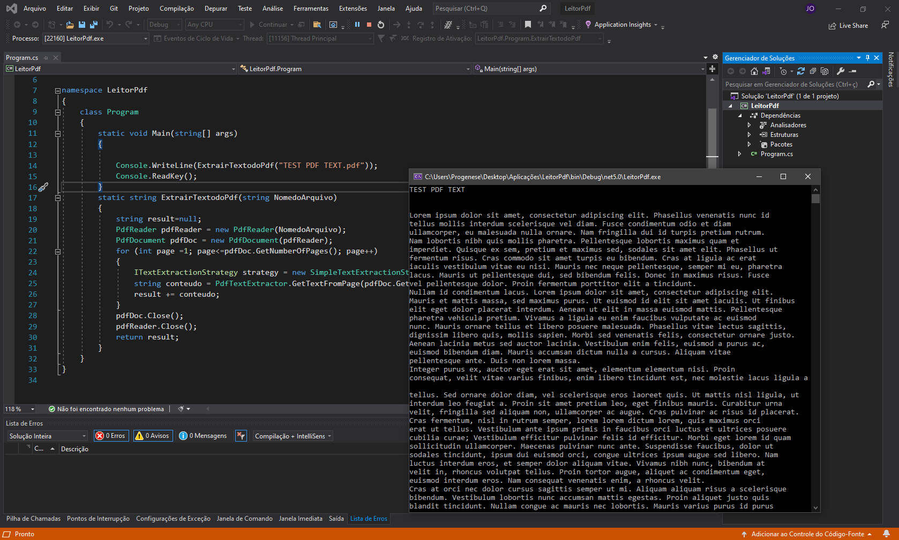

# Aplicação com C#

> Um metódo para usar futuramente, que extrai dados de um pdf (formulários, tabelas)

## Imagens

  
  
  
  
  

## Resumo

O objetivo era iniciar um meio para extrair texto de um pdf com um framework, pra futuramente torna-lo uma aplicação web ou aplicar em um sistema

## Versões - Histórico

* 0.0.1
    * Criação
    * 
## 

[https://github.com/JamesOliveira1](https://github.com/JamesOliveira1/)

